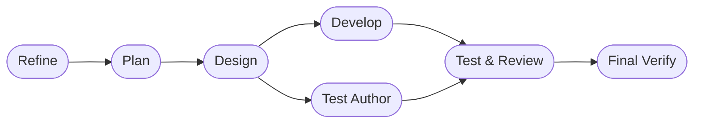

# DASHBOARD

## Actual Progress

- Goal: Repair the release installer so `curl .../install.sh | bash` succeeds on
  Python 3.10 when the build backend would otherwise fall back to
  `bdist_wheel`.
- Prompt-driven scope: Identify why the raw install path fails, update the
  release install flow to use a robust build path, and validate the regression
  with targeted tests.
- Active roadmap focus:
- Phase 6. Installer, Commands, and Environment Diagnostics
- Current workflow phase: final_verify
- Last completed workflow phase: final_verify
- Supervisor verdict: `approved`
- Escalation status: `approved`
- Resume point: No further work is pending unless follow-up packaging coverage
  or a real Python 3.10 runtime repro is requested.

## Workflow Phases

## In Progress

- Root `install.sh` now routes release installs through the venv interpreter's
  `python -m pip install --use-pep517 --upgrade ...` path instead of relying on
  `--no-build-isolation`.
- A targeted regression test was added to pin that behavior so the raw GitHub
  installer does not regress back to the legacy wheel build path.
- Targeted install-script validation passed.

## Progress Notes

- Phase 1 completed: Inspected the root and local install scripts, existing
  install tests, and current packaging metadata to isolate the failing release
  path.
- Phase 2 completed: Chose a packaging fix that forces modern PEP 517 install
  behavior for release installs, while leaving the local editable installer
  unchanged.
- Phase 3 completed: Updated the release installer to run
  `python -m pip install --use-pep517 --upgrade` from the venv interpreter for
  both local-source and downloaded-archive release installs.
- Phase 4 completed: Added a targeted regression test covering the release
  install command shape.
- Phase 5 completed: Ran `python3 -m pytest tests/test_install_script.py -q`
  and confirmed the installer test suite passes after the release-install
  change.
- Validation evidence:
- `python3 -m pytest tests/test_install_script.py -q` -> `4 passed`

## Risks And Watchpoints

- The current environment does not expose `python3.10`, so validation will be
  performed with the repository test suite rather than an actual Python 3.10
  runtime reproduction unless a 3.10 interpreter becomes available.
- Do not stage the local `.codex` marker file.
