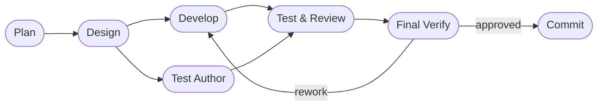

# DASHBOARD

## Actual Progress

- Goal: Daemonize Goals automation + planner/architect/developer/tester/reviewer/committer
  role-based pipeline
- Active roadmap focus: Phase 7. Hardening, Multi-Session, and Productization
- Current workflow phase: complete
- Last completed workflow phase: final verify (515/515 tests pass)
- Supervisor verdict: `approved`
- Resume point: ready for commit

## Workflow Phases

## Completed

All 6 implementation phases done:

1. Config models — `role_config.py`, `goals_config.py`, `AppConfig.agents`, `DaemonConfig.goals`
2. GoalsScheduler — background daemon thread, timer lifecycle, prompt generation
3. PipelineRunner — developer→tester→reviewer→committer with MAX_STAGE_ITERATIONS=3 re-entry
4. DaemonRunner integration — GoalsScheduler started/stopped, PipelineRunner used when agents configured
5. Telegram goals commands — `/goals` list/add/delete with inline keyboard
6. Tests (515 pass), example configs updated, AGENTS.md updated with pipeline docs

## Risks And Watchpoints

None outstanding.
