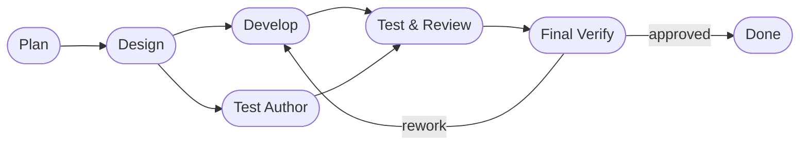

# DASHBOARD

## Actual Progress

- Goal: Reproduce the daemon `SIGTERM` shutdown failure during an active prompt,
  fix the shutdown path, and verify the fix with automated and manual
  integration coverage.
- Prompt-driven scope: Create a minimal real project, run `dormammu daemonize`
  against it, send `SIGTERM` while the active agent CLI is still processing,
  and make the daemon stop promptly without corrupting resumable state.
- Active roadmap focus:
- Phase 4. Supervisor Validation, Continuation Loop, and Resume
- Current workflow phase: final_verification
- Last completed workflow phase: final_verification
- Supervisor verdict: `approved`
- Escalation status: `pending`
- Resume point: No further work is pending unless the user requests commit
  preparation or broader shutdown coverage.

## Workflow Phases

## In Progress

- The shutdown-path fix is implemented.
- Focused automated validation passed for daemon shutdown and CLI timeout
  coverage.
- The requested manual integration repro under `~/samba/test` now exits
  promptly on `SIGTERM` and preserves the source prompt for retry.

## Progress Notes

- Plan completed: replaced the stale commit/push workflow view with this
  SIGTERM investigation scope in operator-facing state.
- Design completed: identified `CliAdapter.run_once()` blocking on the active
  subprocess as the critical shutdown bottleneck for in-flight prompts.
- Development completed: `DaemonRunner` now injects the shutdown event into the
  active `CliAdapter` path, and the adapter terminates the active agent
  process group on daemon shutdown before unwinding with an interrupt status.
- Automated validation completed:
- `python3 -m pytest tests/test_daemon.py`
- `python3 -m pytest tests/test_daemon_hardening.py`
- `python3 -m pytest tests/test_agent_cli_adapter.py -k 'waits_before_second_agent_cli_call_and_logs_message or waits_between_fallback_cli_attempts'`
- `python3 -m pytest tests/test_agent_cli_adapter.py -k 'run_once_writes_artifacts_and_updates_state or run_once_uses_codex_exec_preset_for_positional_prompt'`
- `python3 -m pytest tests/test_improvements.py -k 'process_timeout_terminates_hanging_cli or no_timeout_when_process_timeout_seconds_is_none or timeout_message_is_written_to_live_output_stream'`
- Manual repro before fix:
- Temp project: `/tmp/dormammu-sigterm-repro-pre`
- Observed behavior: `SIGTERM` was logged, but `daemonize` stayed alive for at
  least 5 seconds until force-killed.
- Manual repro after fix:
- Project: `/home/hjhun/samba/test/dormammu-sigterm-manual-20260414-213545`
- Observed behavior: `SIGTERM` completed in about `0.11s`, `daemonize`
  returned `130`, the child agent logged `WORKER::got-signal::15`, and the
  source prompt file remained in `queue/prompts/001-test.md`.
- Repository watchpoint: `.dev/PROJECT.md` and `.dev/ROADMAP.md` are currently
  absent, so AGENTS precedence falls through to the existing workflow state and
  repository code.

## Risks And Watchpoints

- The fix must not regress normal `run-once` / `run` command behavior or the
  existing process-timeout handling.
- The shutdown path must not delete an in-flight prompt file when the run is
  interrupted by `SIGTERM`.
- The child-process termination path should avoid leaving orphaned agent
  processes behind.
