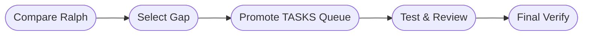

# DASHBOARD

## Actual Progress

- Goal: Compare the local `ralph` loop project with `dormammu` and implement a
  meaningful gap-closing improvement.
- Prompt-driven scope: Analyze Ralph's loop/task-state model, identify the most
  relevant missing behavior in `dormammu`, and implement it with regression
  coverage.
- Active roadmap focus:
- Phase 4. Supervisor Validation, Continuation Loop, and Resume
- Phase 5. CLI Operator Experience and Progress Visibility
- Current workflow phase: final_verify
- Last completed workflow phase: final_verify
- Supervisor verdict: `approved`
- Escalation status: `approved`
- Resume point: Work is complete unless the user wants commit preparation or a
  broader Ralph-inspired follow-up.

## Workflow Phases

## In Progress

- Compared `ralph`'s shell loop, persistent learning model, and explicit task
  queue against `dormammu`'s supervised/session-based runtime.
- Chose `.dev/TASKS.md` promotion as the highest-value missing piece because it
  maps Ralph's first-class work queue concept onto `dormammu`'s existing state
  model without weakening supervision.
- Updated the state repository, workflow state model, supervisor checks,
  documentation, and tests so `TASKS.md` is now a real runtime-owned operator
  queue.

## Progress Notes

- Comparison result: `ralph`'s main advantage over current `dormammu` was not
  simpler looping but stronger task-queue concreteness across iterations.
- Implementation result: bootstrap, mirror sync, task parsing, and session/root
  metadata now create and track `.dev/TASKS.md` as a first-class file.
- Runtime result: task sync now prefers `TASKS.md`, so resume targeting and
  completion checks follow the queue document rather than only `PLAN.md`.
- Validation evidence:
- `python3 -m pytest tests/test_state_repository.py tests/test_improvements.py -q`
  -> `55 passed`
- `python3 -m pytest tests/test_tasks.py tests/test_supervisor.py tests/test_loop_runner.py -q`
  -> `23 passed`
- `python3 -m pytest tests/test_ralph_improvements.py -q` -> `27 passed`

## Risks And Watchpoints

- Existing session JSON machine state still reflects the prior completed task;
  a future state-refresh run should regenerate it if this repository wants full
  `.dev` machine/operator alignment for the new scope.
- Do not stage the local `.codex` marker file.
