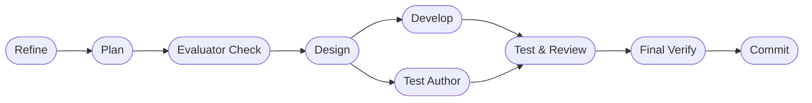

# DASHBOARD

## Actual Progress

- Goal: Implement the approved evaluator checkpoint architecture and package
  stable runtime rule contracts under `agents/rules/`.
- Prompt-driven scope: replace one-shot stage prompt hardcoding with packaged
  rule assets, keep the mandatory post-plan evaluator checkpoint, keep the
  goals-only post-commit evaluator, and validate the full repository test
  suite.
- Active roadmap focus:
- Phase 4. Supervisor Validation, Continuation Loop, and Resume
- Phase 7. Hardening, Multi-Session, and Productization
- Current workflow phase: final_verification
- Last completed workflow phase: final_verification
- Supervisor verdict: `approved`
- Escalation status: `not_needed`
- Resume point: await user direction for commit preparation or additional
  follow-up work.

## Workflow Phases

## In Progress

- Runtime rule contracts now load from `agents/rules/` with packaged-asset
  fallback through `backend/dormammu/daemon/rules.py`.
- The mandatory post-plan evaluator checkpoint remains in `PipelineRunner`,
  and the post-commit evaluator remains mandatory only for goals-scheduler
  prompts.
- Full repository validation completed with `python3 -m pytest`.

## Progress Notes

- Implementation completed: added `agents/rules/` plus mirrored packaged rule
  assets so installed environments receive the same runtime contracts.
- Implementation completed: migrated `PipelineRunner` and final evaluator
  prompt assembly to rules-based loading instead of embedding large prompt
  bodies directly in Python.
- Validation completed: fixed the install-script fake loop harness so it
  recognizes the new refiner/planner/evaluator prelude prompts without
  inflating loop-attempt counts.
- Validation completed: `python3 -m pytest` passed with `627 passed in
  68.25s`.

## Risks And Watchpoints

- No commit was created in this pass; commit and any goals-only final evaluator
  run remain intentionally skipped until requested.
- Reviewer and tester verdict parsing still defaults to fail-open outside the
  new evaluator checkpoint work, so stricter downstream gating remains a future
  hardening target.
