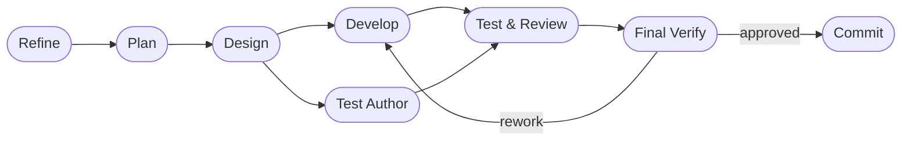

# DASHBOARD

## Actual Progress

- Goal: Make `refine -> plan` mandatory in `run`, `run-once`, and `daemonize`,
  and add an `analyzer` expert to goals prompt generation
- Prompt-driven scope: runtime prelude enforcement, goals analyzer/planner
  chaining, workflow-contract prompt strengthening, and regression coverage
- Active roadmap focus: Phase 4. Supervisor Validation, Continuation Loop, and
  Resume
- Current workflow phase: commit
- Last completed workflow phase: final verification
- Supervisor verdict: `approved`
- Escalation status: `approved`
- Resume point: ready for commit preparation and push

## Workflow Phases

## In Progress

`run`, `run-once`, and `daemonize` now execute a mandatory `refine -> plan`
prelude before their non-pipeline execution paths, while goals prompt
generation can use `analyzer -> planner -> architect` and now emits an
explicit workflow contract that makes the planner authoritative after `plan`.

## Progress Notes

- Added `analyzer` to the configurable role model and example config
- Made `PipelineRunner` treat `refiner` and `planner` as mandatory stages with
  active CLI fallback
- Enforced the mandatory prelude in CLI and daemon single-agent paths while
  preserving explicit `--agent-cli` routing by overriding all prelude roles to
  that CLI
- Updated goals prompt generation to include requirements analysis and a
  workflow contract
- Updated `README.md`, `docs/GUIDE.md`, and `docs/ko/GUIDE.md` so the public
  docs match the new runtime and goals behavior
- Updated regression tests and fake CLI helpers so prelude prompts do not get
  counted as developer attempts
- Targeted validation passed:
  `python3 -m pytest tests/test_role_config.py tests/test_pipeline_runner.py tests/test_goals_scheduler.py -q`
  `timeout 30s python3 -m pytest tests/test_cli.py -q -k 'run_once_executes_external_cli_and_prints_result' -vv`
  `timeout 45s python3 -m pytest tests/test_cli.py -q -k 'run_loop_and_resume_loop_cover_phase_4_cli_flow or run_loop_emits_dashboard_and_tasks_snapshots_to_stderr_each_attempt or run_once_uses_configured_active_agent_cli_when_flag_is_omitted'`
  `timeout 45s python3 -m pytest tests/test_daemon.py -q`
  `python3 -m pytest tests/test_mermaid_docs.py -q`

## Risks And Watchpoints

- Some broad pytest bundles that include goals-related timer behavior can take
  longer to shut down than the targeted subsets above, so broader validation is
  still worth doing before a release cut.
