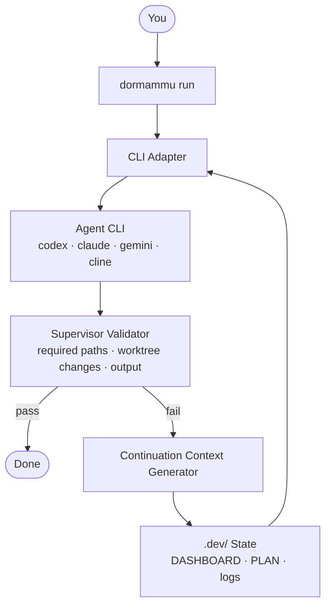
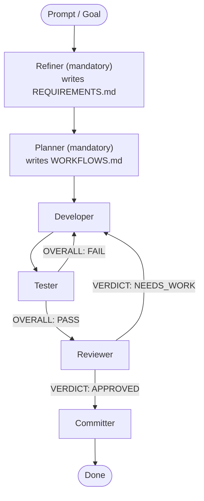
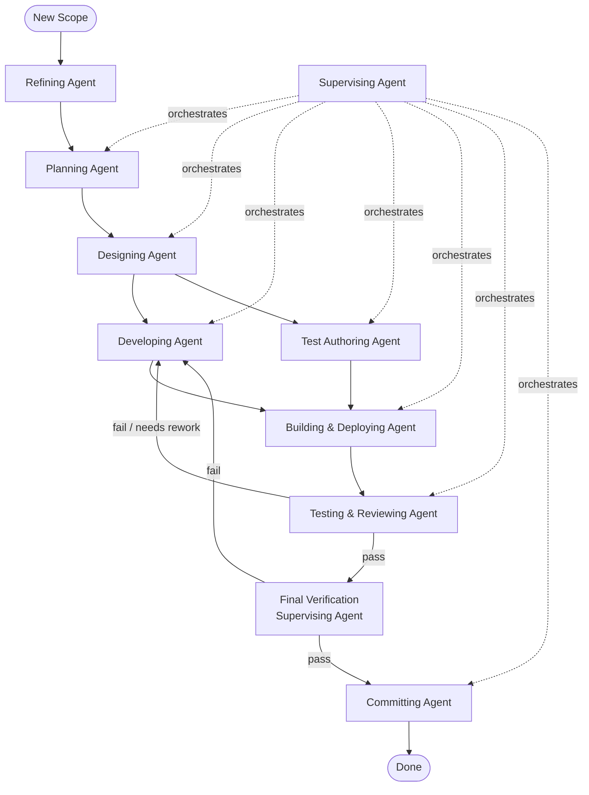

<p align="center">
  
</p>

<h1 align="center">DORMAMMU</h1>

<p align="center">
  <strong>A supervised, resumable loop orchestrator for coding agents.</strong>
</p>

<p align="center">
  <a href="https://github.com/hjhun/dormammu/blob/main/LICENSE"></a>
  <a href="https://www.python.org/downloads/"></a>
  
</p>

<p align="center">
  <a href="docs/GUIDE.md">Full Guide</a> ·
  <a href="#installation">Installation</a> ·
  <a href="#quick-start">Quick Start</a>
</p>

---

`dormammu` wraps any external coding-agent CLI — `codex`, `claude`, `gemini`,
`cline`, or your own — in a supervisor-driven loop that validates results,
generates continuation context, retries on failure, and stores everything under
`.dev/` so work can be resumed at any point.

## Why DORMAMMU

Coding agents are powerful, but a single agent invocation is fragile:

- The run may be interrupted
- The result may be incomplete or wrong
- You may not know which step failed or why

DORMAMMU solves this by adding a **supervisor** layer and a **state machine**
around the agent call. Every run is logged, validated, and resumable. The
`.dev/` directory becomes your control surface — readable by humans and
automation alike.

## Highlights

| Feature | Description |
|---------|-------------|
| **Supervised retry loops** | The supervisor validates each agent result and generates continuation context for the next attempt |
| **Resumable execution** | Prompts, logs, session metadata, and machine state are persisted under `.dev/` — resume after any interruption |
| **Multi-CLI adapter** | Drive `codex`, `claude`, `gemini`, and `cline` through a unified runtime with preset-aware command building |
| **Refine & Plan stages** | A refining agent converts raw goals into `REQUIREMENTS.md`; a planning agent generates an adaptive `WORKFLOWS.md` checklist |
| **Role-based pipeline** | Route goals through `refiner → planner → developer → tester → reviewer → committer` with automated feedback loops |
| **Goals analysis experts** | Use `analyzer → planner → architect` to turn scheduled goals into stronger execution prompts before runtime starts |
| **Daemonize mode** | Watch a prompt directory, queue incoming files in deterministic order, and run each through the supervised pipeline |
| **Goals automation** | Schedule periodic goals that are automatically promoted into the daemon queue; manageable via Telegram |
| **Fallback CLIs** | Automatically switch to a backup agent CLI when the primary hits quota or token exhaustion |
| **Guidance injection** | Embed repository guidance (`AGENTS.md`, custom `--guidance-file`) into every agent prompt |
| **Operator-visible state** | `DASHBOARD.md`, `PLAN.md`, `WORKFLOWS.md`, and `workflow_state.json` keep progress visible at a glance |
| **Session management** | Start named sessions, list saved snapshots, and restore older sessions at any time |
| **Environment diagnostics** | `doctor` checks Python, CLI availability, repository writability, and workspace structure |

## Supported Agent CLIs

DORMAMMU ships preset-aware adapters for:

| CLI | Prompt style | Workdir | Auto-approval |
|-----|-------------|---------|---------------|
| `codex` | exec + positional | — | `--dangerously-bypass-approvals-and-sandbox` |
| `claude` | print-mode | — | `--dangerously-skip-permissions` |
| `gemini` | prompt flag | `--include-directories` | `--approval-mode yolo` |
| `cline` | positional + `-y` | `--cwd` | `-y` |

Any other CLI can be used with `--extra-arg` pass-through.

## How It Works

### Run Modes

DORMAMMU has three execution modes:

| Mode | Command | Description |
|------|---------|-------------|
| **run-once** | `dormammu run-once` | One bounded agent call with artifact capture, no retry |
| **run** | `dormammu run` | Full supervised retry loop with validation and continuation |
| **daemonize** | `dormammu daemonize` | Long-running daemon that watches a prompt queue |

Every execution mode now begins with a mandatory `refine -> plan` prelude.
After that prelude:

- when `agents` is configured, DORMAMMU continues through the full
  **PipelineRunner**
- when `agents` is absent, `run` and `daemonize` continue through the
  single-agent **LoopRunner**
- when `agents` is absent, `run-once` continues through a single bounded
  **CliAdapter** call

### Single-Agent Loop

Without `agents` config, the runtime still starts with `refine -> plan`, then
the supervised loop works like this:



### Role-Based Pipeline

When `agents` is configured, goals flow through a full multi-role pipeline:



**Refiner** (mandatory): Converts the raw goal into a structured
`.dev/REQUIREMENTS.md` — clarifying scope, acceptance criteria, constraints,
and risks — before any code is written. It uses `agents.refiner.cli` when
configured and otherwise falls back to `active_agent_cli`.

**Planner** (mandatory): Reads `REQUIREMENTS.md` and produces `.dev/WORKFLOWS.md`,
an adaptive, task-specific stage checklist (`[ ] Phase N. Role — agent`).
Also updates `PLAN.md` and `DASHBOARD.md`. It uses `agents.planner.cli` when
configured and otherwise falls back to `active_agent_cli`.

**Developer**: Implements the active scope, guided by `REQUIREMENTS.md` and
`WORKFLOWS.md` when available.

**Tester**: Black-box validation — appends `OVERALL: PASS` or `OVERALL: FAIL`
as its last output line. A `FAIL` routes the developer back with the report.

**Reviewer**: Code review against the goal and any architect design document.
Appends `VERDICT: APPROVED` or `VERDICT: NEEDS_WORK`. After three round-trips
the pipeline advances unconditionally.

**Committer**: Stages only the active scope and produces an intentional git
commit after the reviewer approves.

### Guidance Framework

DORMAMMU ships a bundled guidance framework (`agents/`) that routes multi-phase
work through specialized agent roles. The Supervising Agent controls all phase
transitions.



See [docs/GUIDE.md](docs/GUIDE.md) for a full description of each agent role.

## Installation

### Quick Install (recommended)

```bash
curl -fsSL https://raw.githubusercontent.com/hjhun/dormammu/main/install.sh | bash
```

### From a Local Clone

```bash
./scripts/install.sh
```

### Editable Development Install

```bash
python3 -m venv .venv
. .venv/bin/activate
pip install -e .
```

Requires Python `3.10+`.

## Quick Start

### 1. Check your environment

```bash
dormammu doctor --repo-root . --agent-cli codex
```

### 2. Initialize `.dev` state

```bash
dormammu init-state \
  --repo-root . \
  --goal "Implement the requested repository change safely."
```

`init-state` also probes for installed coding-agent CLIs and sets
`active_agent_cli` to the highest-priority available command:
`codex` › `claude` › `gemini` › `cline`.

### 3. Run the supervised loop

```bash
dormammu run \
  --repo-root . \
  --agent-cli codex \
  --prompt-file PROMPT.md \
  --required-path README.md \
  --require-worktree-changes \
  --max-iterations 50
```

### 4. Resume after interruption

```bash
dormammu resume --repo-root .
```

### 5. Run as a background daemon

```bash
dormammu daemonize --repo-root . --config daemonize.json
```

See [config/daemonize.json.example](config/daemonize.json.example) for a starting config.

## Commands

### All Commands

| Command | Alias | Description |
|---------|-------|-------------|
| `doctor` | — | Verify environment — Python version, CLI path, repo writability, workspace structure |
| `init-state` | — | Bootstrap or refresh `.dev/` state for a repository |
| `show-config` | — | Print the resolved runtime config and its source path |
| `set-config` | — | Set or modify a config value in `dormammu.json` or `~/.dormammu/config` |
| `inspect-cli` | — | Show resolved CLI adapter details — prompt mode, flags, preset match |
| `run-once` | — | One bounded agent call with artifact capture, no retry loop |
| `run` | `run-loop` | Full supervised retry loop with validation and continuation |
| `resume` | `resume-loop` | Continue a previous `run` from saved loop state |
| `daemonize` | — | Long-running daemon that watches a prompt directory and processes a queue |
| `start-session` | — | Archive the current session and begin a new named session |
| `sessions` | — | List all saved session snapshots |
| `restore-session` | — | Restore an older session into the active `.dev/` view |

Full reference: `dormammu --help` or `dormammu <command> --help`.

### `run` Options

| Option | Default | Description |
|--------|---------|-------------|
| `--repo-root` | `.` | Repository root directory |
| `--agent-cli` | from config | Agent CLI to use (overrides `active_agent_cli`; bypasses PipelineRunner) |
| `--prompt` | — | Inline prompt text (mutually exclusive with `--prompt-file`) |
| `--prompt-file` | — | Path to a prompt file (mutually exclusive with `--prompt`) |
| `--input-mode` | `auto` | How the prompt is passed: `auto` `file` `arg` `stdin` `positional` |
| `--max-iterations` | `50` | Total attempt budget (`-1` for infinite) |
| `--max-retries` | — | Retry budget (alternative to `--max-iterations`) |
| `--required-path` | — | File that must exist after the run (repeatable) |
| `--require-worktree-changes` | off | Fail validation if the worktree has no changes |
| `--workdir` | — | Working directory for the agent process |
| `--guidance-file` | — | Additional guidance files to embed in the prompt (repeatable) |
| `--extra-arg` | — | Pass-through flags to the agent CLI (repeatable) |
| `--run-label` | — | Human-readable label for this run (appears in logs) |
| `--session-id` | — | Attach run to a specific session |
| `--prompt-flag` | — | Override the flag used to pass the prompt to the CLI |
| `--debug` | off | Write `DORMAMMU.log` at the repository root |

> **Note:** When `--agent-cli` is explicitly provided, DORMAMMU still runs the
> mandatory `refine -> plan` prelude first, then uses the single-agent runtime
> path for that invocation. This lets you bypass specialist downstream roles
> without skipping the planning contract.

### `set-config` Options

| Option | Description |
|--------|-------------|
| `key` | Config key to set (e.g. `active_agent_cli`) |
| `value` | Value to assign |
| `--add` | Append value to a list field |
| `--remove` | Remove value from a list field |
| `--unset` | Remove the key entirely |
| `--global` | Write to `~/.dormammu/config` instead of project-level `dormammu.json` |

### `daemonize` Options

| Option | Description |
|--------|-------------|
| `--repo-root` | Repository root directory |
| `--config` | Path to the daemon queue config file (`daemonize.json`) |
| `--guidance-file` | Additional guidance files (repeatable) |
| `--debug` | Write per-prompt progress logs under `result_path/../progress/` |

## Configuration

### Runtime config (`dormammu.json`)

Resolved in this order:

1. `DORMAMMU_CONFIG_PATH` env variable
2. `<repo-root>/dormammu.json`
3. `~/.dormammu/config`

```json
{
  "active_agent_cli": "/home/you/.local/bin/codex",
  "fallback_agent_clis": [
    "claude",
    "gemini"
  ],
  "cli_overrides": {
    "cline": { "extra_args": ["-y", "--verbose", "--timeout", "1200"] }
  },
  "token_exhaustion_patterns": [
    "usage limit", "quota exceeded", "rate limit exceeded"
  ],
  "agents": {
    "analyzer":  { "cli": "claude", "model": "claude-sonnet-4-6" },
    "refiner":   { "cli": "claude", "model": "claude-sonnet-4-6" },
    "planner":   { "cli": "claude", "model": "claude-sonnet-4-6" },
    "developer": { "cli": "claude", "model": "claude-opus-4-6" },
    "tester":    { "cli": "claude", "model": "claude-sonnet-4-6" },
    "reviewer":  { "cli": "claude", "model": "claude-sonnet-4-6" },
    "committer": { "cli": "claude" }
  }
}
```

When `agents` is configured, all run modes (`run`, `run-once`, `daemonize`)
use the role-based pipeline. Providing `--agent-cli` on the command line reverts
to the single-agent downstream path for that invocation after the mandatory
`refine -> plan` prelude completes.

`analyzer` is used by goals automation to turn a scheduled goal into a
requirements-focused brief before planning. `refiner` and `planner` are now
mandatory runtime stages and fall back to `active_agent_cli` when no
role-specific CLI is configured.

### Daemon queue config (`daemonize.json`)

Separate from `dormammu.json`. Controls prompt watching and queue behavior.

```json
{
  "schema_version": 1,
  "prompt_path": "./queue/prompts",
  "result_path": "./queue/results",
  "watch": { "poll_interval_seconds": 60, "settle_seconds": 0 },
  "queue": { "allowed_extensions": [".md", ".txt"] },
  "goals": { "path": "./goals", "interval_minutes": 60 }
}
```

Example configs under `config/`:

| File | Use when |
|------|----------|
| `daemonize.json.example` | Default — mixed `.md` and `.txt` prompt queue |
| `daemonize.named-skill.example.json` | Markdown-only queue |
| `daemonize.mixed-skill-resolution.example.json` | Editor writes files in multiple passes; add settle delay |
| `daemonize.phase-specific-clis.example.json` | Shorter polling interval for faster scan cadence |

## What Gets Written

Every run leaves behind inspectable artifacts:

| Path | Contents |
|------|----------|
| `.dev/00-analyzer/` | Requirements analysis snapshots produced during goals prompt generation |
| `.dev/REQUIREMENTS.md` | Structured requirements produced by the refining agent |
| `.dev/WORKFLOWS.md` | Adaptive stage checklist produced by the planning agent |
| `.dev/DASHBOARD.md` | Operator-facing progress, active phase, next action, risks |
| `.dev/PLAN.md` | Prompt-derived task checklist (`[ ]` / `[O]` phase items) |
| `.dev/workflow_state.json` | Machine-readable workflow state (source of truth) |
| `.dev/session.json` | Active session metadata |
| `.dev/logs/` | Prompt, stdout, stderr, and run metadata artifacts |
| `DORMAMMU.log` | Project-level execution log (written with `--debug`) |

## Common Patterns

### Use repository guidance automatically

```bash
dormammu run \
  --repo-root . \
  --agent-cli codex \
  --prompt "Follow AGENTS.md and implement the requested change."
```

Guidance resolution order: `--guidance-file` flags › `AGENTS.md` / `agents/AGENTS.md` ›
`~/.dormammu/agents` › packaged fallback assets.

### Run in a subproject directory

```bash
dormammu run-once \
  --repo-root . \
  --agent-cli cline \
  --workdir ./subproject \
  --prompt "Inspect this subproject and report the failing test surface."
```

### Pass extra flags to the agent CLI

```bash
dormammu run-once \
  --repo-root . \
  --agent-cli gemini \
  --prompt "Summarize the repo." \
  --extra-arg=--approval-mode \
  --extra-arg=auto_edit
```

### Use an environment-specific config

```bash
DORMAMMU_CONFIG_PATH=./ops/dormammu.prod.json \
  dormammu daemonize --repo-root . --config ./ops/daemonize.prod.json
```

## Repository Layout

```text
backend/     Python package — loop engine, CLI adapters, state, supervisor, daemon
agents/      Distributable workflow and skill guidance bundle
templates/   Bootstrap templates for .dev/ state files
config/      Example configuration files
docs/        User and operator documentation
scripts/     Install and developer convenience scripts
tests/       Runtime, adapter, and workflow validation
```

## Release

`v*` tag pushes and manual workflow dispatches build wheel and sdist artifacts
via `.github/workflows/release.yml`. The packaged build includes the guidance
bundle used for installed fallback behavior.

## License

DORMAMMU is licensed under the **Apache License 2.0**. See [LICENSE](LICENSE).
