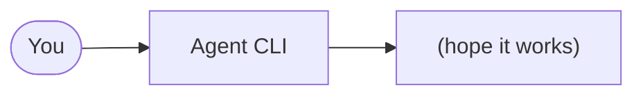
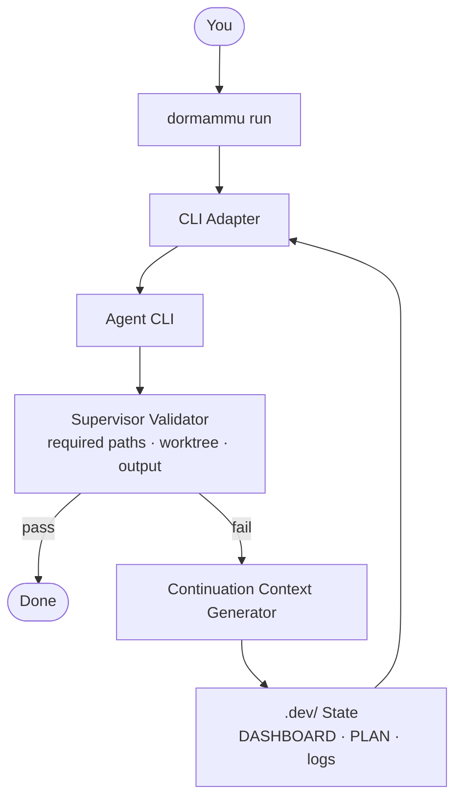
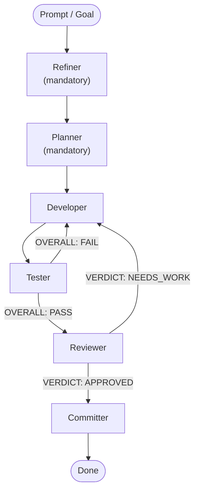
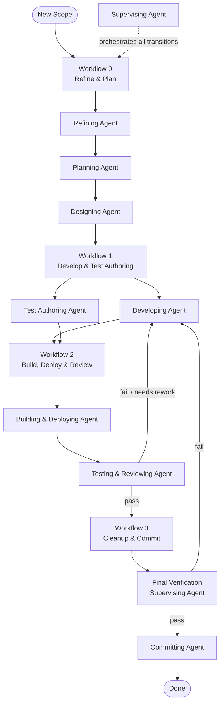
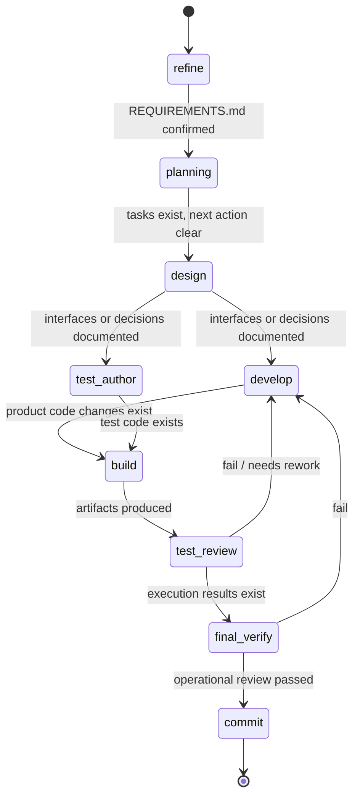

# DORMAMMU — Full Guide

`dormammu` is a CLI-first loop orchestrator for coding agents. It wraps an
external agent CLI with a supervisor, resumable state management, and
operator-visible artifacts — so agent runs are repeatable, inspectable, and
safe to continue after any interruption.

For a quick overview read the main [README.md](../README.md) first. The
Korean-language guide is at [docs/ko/GUIDE.md](ko/GUIDE.md).

---

## Table of Contents

- [What DORMAMMU Does](#what-dormammu-does)
- [Core Concepts](#core-concepts)
- [Interactive Shell](#interactive-shell)
- [How It Works — Run Modes](#how-it-works--run-modes)
- [Installation](#installation)
- [Quick Start](#quick-start)
- [Commands Reference](#commands-reference)
- [Configuration Reference](#configuration-reference)
- [Agent Roles](#agent-roles)
- [Workflow Pipeline](#workflow-pipeline)
- [Daemonize Mode](#daemonize-mode)
- [Role-Based Agent Pipeline](#role-based-agent-pipeline)
- [Goals Automation](#goals-automation)
- [Guidance Files](#guidance-files)
- [The `.dev` Directory](#the-dev-directory)
- [Session Management](#session-management)
- [Fallback Agent CLIs](#fallback-agent-clis)
- [Working Directory and CLI Overrides](#working-directory-and-cli-overrides)
- [Typical Operator Flow](#typical-operator-flow)
- [Repository Layout](#repository-layout)

---

## What DORMAMMU Does

Without DORMAMMU, running a coding agent looks like:



With DORMAMMU:



The supervisor checks:

- Did required files change?
- Did the worktree change?
- Did the agent produce a meaningful result?

If not, DORMAMMU generates continuation context and retries — up to your
configured limit. When the supervisor approves the work, the loop exits
immediately.

Everything the agent sees and produces is logged under `.dev/` for later
inspection or resumption.

---

## Core Concepts

### Supervised loop

`dormammu run` wraps an agent call in a retry loop. After each attempt, the
supervisor evaluates the result. On failure, it constructs a continuation
prompt with the previous output and submits another attempt.

### Resumable state

All workflow state — prompts, logs, session metadata, machine state — is
persisted under `.dev/`. If the process is interrupted, `dormammu resume`
picks up from the last saved state instead of starting over.

### CLI adapter

DORMAMMU translates its internal representation of a run request into the
correct invocation for the target CLI. Preset-aware adapters handle prompt
style, command prefix, workdir flags, and auto-approval arguments for each
known CLI.

### Role-based pipeline

When `agents` is configured in `dormammu.json`, all run modes route each goal
through a multi-role pipeline:

```
refiner (mandatory) → planner (mandatory) → developer → tester → reviewer → committer
```

The **refiner** converts the raw goal into structured requirements; the
**planner** produces an adaptive workflow checklist. Both stages are mandatory
runtime entry stages and fall back to `active_agent_cli` when their role CLI is
not explicitly configured.

---

## Interactive Shell

Running `dormammu` with no subcommand starts the default interactive shell. You
can also enter it explicitly with:

```bash
dormammu shell
```

The shell is intentionally lightweight:

- top area for logs and summaries
- bottom prompt for free-text input and slash commands
- free-text input maps to supervised `run` behavior by default

Core shell commands:

| Command | Description |
|-------|------------|
| free text | Submit a supervised `/run` request |
| `/run <prompt>` | Run the supervised loop explicitly |
| `/run-once <prompt>` | Run one bounded execution |
| `/resume` | Resume the latest interrupted run |
| `/show-config` | Print the resolved config |
| `/config get|set|add|remove|unset ...` | Read or mutate supported config keys |
| `/sessions` | List known sessions |
| `/daemon start|stop|status|logs|enqueue|queue` | Control or observe the daemon worker |
| `/exit` | Exit the shell |

`daemonize` itself remains a worker-oriented queue processor. The shell is the
operator control plane for that worker: `/daemon enqueue` writes prompt files,
and `/daemon logs` or `/daemon status` reads daemon output and metadata.

---

## How It Works — Run Modes

DORMAMMU has four operator entry styles. Their behavior depends on whether `agents`
is configured in `dormammu.json`.

### Interactive entry

| Mode | What runs |
|------|-----------|
| `dormammu` or `dormammu shell` | `InteractiveShellRunner`, which delegates work back into the existing CLI/runtime stack |

### Without `agents` config

| Mode | What runs |
|------|-----------|
| `run-once` | mandatory `refine -> plan`, then `CliAdapter` — one bounded agent call |
| `run` | mandatory `refine -> plan`, then `LoopRunner` — supervised retry loop with a single agent |
| `daemonize` | mandatory `refine -> plan`, then `LoopRunner` per queued prompt |

### With `agents` config

| Mode | What runs |
|------|-----------|
| `run-once` | `PipelineRunner` — one full pipeline pass (refiner → … → committer) |
| `run` | `PipelineRunner` — one full pipeline pass |
| `daemonize` | `PipelineRunner` — one full pipeline pass per queued prompt |

> **Override:** If `--agent-cli` is explicitly provided on the command line,
> DORMAMMU still executes the mandatory `refine -> plan` prelude, then uses the
> single-agent downstream path (LoopRunner / CliAdapter) regardless of the
> `agents` config. This lets you bypass specialist downstream roles for one-off
> runs without skipping planning.

### PipelineRunner stages



Each stage writes its output to a numbered slot under `.dev/`:

| Stage | Output path |
|-------|------------|
| analyzer | `.dev/00-analyzer/` |
| refiner | `.dev/00-refiner/` → `.dev/REQUIREMENTS.md` |
| planner | `.dev/01-planner/` → `.dev/WORKFLOWS.md` |
| developer | `.dev/01-developer/` |
| tester | `.dev/04-tester/` |
| reviewer | `.dev/05-reviewer/` |
| committer | `.dev/06-committer/` |

---

## Installation

### Quick Install (recommended)

```bash
curl -fsSL https://raw.githubusercontent.com/hjhun/dormammu/main/install.sh | bash
```

### From a Local Clone

```bash
./scripts/install.sh
```

### Editable Development Install

```bash
python3 -m venv .venv
. .venv/bin/activate
pip install -e .
```

Requires Python `3.10+`. See [docs/ko/UBUNTU_PYTHON_310_PLUS.md](ko/UBUNTU_PYTHON_310_PLUS.md)
for Ubuntu setup notes.

---

## Quick Start

### 1. Verify the environment

```bash
dormammu doctor --repo-root . --agent-cli codex
```

Checks Python version, agent CLI availability, workspace directory presence,
and repository write access.

### 2. Initialize `.dev` state

```bash
dormammu init-state \
  --repo-root . \
  --goal "Implement the requested repository task."
```

Creates or refreshes:

- `.dev/DASHBOARD.md`
- `.dev/PLAN.md`
- `.dev/session.json`
- `.dev/workflow_state.json`

Also probes for installed coding-agent CLIs and sets `active_agent_cli` to the
highest-priority available command: `codex` › `claude` › `gemini` › `cline`.

### 3. Confirm which config file is loaded

```bash
dormammu show-config --repo-root .
```

Prints the resolved config as JSON, including which file was loaded
(`dormammu.json`, `DORMAMMU_CONFIG_PATH`, or `~/.dormammu/config`).

### 4. Inspect the CLI adapter

```bash
dormammu inspect-cli --repo-root . --agent-cli cline
```

Shows the resolved prompt mode, preset match, command prefix, workdir flag
support, and approval-related hints — useful before a real run.

### 5. Run one agent call

```bash
dormammu run-once \
  --repo-root . \
  --agent-cli codex \
  --prompt "Read the repo guidance and summarize the next implementation step."
```

`run-once` always executes the mandatory `refine -> plan` prelude first, then
runs a single bounded downstream agent invocation with artifact capture and no
retry loop.

### 6. Run the supervised loop

```bash
dormammu run \
  --repo-root . \
  --agent-cli codex \
  --prompt-file PROMPT.md \
  --required-path README.md \
  --require-worktree-changes \
  --max-iterations 50
```

The loop runs until the supervisor approves or the iteration limit is reached.
Default limit is `50` when neither `--max-iterations` nor `--max-retries` is
set.

### 7. Resume later

```bash
dormammu resume --repo-root .
```

Reloads the saved loop state and continuation context, then restarts from the
recovery path.

### 8. Use the interactive shell

```bash
dormammu
```

Example shell session:

```text
/config get active_agent_cli
/run Implement the next prompt-derived task safely.
/daemon status
/daemon enqueue Audit the queued prompt set.
/exit
```

---

## Commands Reference

### `dormammu doctor`

Environment diagnostics. Checks:

- Python version (≥ 3.10)
- Agent CLI path and availability
- `.agent` or `.agents` workspace directory presence
- Repository root write access

```bash
dormammu doctor --repo-root . --agent-cli codex
```

### `dormammu init-state`

Bootstrap or refresh `.dev/` state. Use before the first run in any
repository, or to reset state after a goal change.

```bash
dormammu init-state \
  --repo-root . \
  --goal "Ship the requested change safely."
```

### `dormammu show-config`

Print the resolved runtime config and its source file.

```bash
dormammu show-config --repo-root .
```

### `dormammu set-config`

Set or modify a config value. Supports scalar assignment and list operations.

```bash
# Set a scalar value
dormammu set-config active_agent_cli claude

# Append to a list
dormammu set-config token_exhaustion_patterns "rate limit" --add

# Remove from a list
dormammu set-config fallback_agent_clis gemini --remove

# Write to global config instead of project config
dormammu set-config active_agent_cli codex --global
```

### `dormammu inspect-cli`

Show the resolved CLI adapter details as JSON.

```bash
dormammu inspect-cli --repo-root . --agent-cli codex
```

Output includes:

- `prompt_mode`: how the prompt is passed (positional, flag, stdin)
- `preset_name`: matched known preset if any
- `command_prefix`: any prefix added before the prompt
- `workdir_flag`: the flag used to set working directory
- `approval_hints`: any auto-approval flags that will be injected

### `dormammu run-once`

Execute one agent invocation. Stores the prompt artifact, stdout, stderr, and
run metadata. Does not retry.

When `agents` is configured (and `--agent-cli` is not explicitly provided),
`run-once` continues into one full pipeline pass after the mandatory prelude.

```bash
dormammu run-once \
  --repo-root . \
  --agent-cli codex \
  --prompt "Summarize the repository."
```

### `dormammu run`

Execute the supervised retry loop (single-agent) or one full pipeline pass
(when `agents` is configured and `--agent-cli` is not provided).

```bash
dormammu run \
  --repo-root . \
  --agent-cli codex \
  --prompt-file PROMPT.md \
  --required-path README.md \
  --require-worktree-changes \
  --max-iterations 50
```

Key options:

| Option | Default | Description |
|--------|---------|-------------|
| `--prompt` / `--prompt-file` | — | Inline prompt text or path to a prompt file |
| `--agent-cli` | from config | CLI to drive; still runs the mandatory prelude, then bypasses specialist downstream roles when set |
| `--input-mode` | `auto` | Prompt pass mode: `auto` `file` `arg` `stdin` `positional` |
| `--required-path` | — | File that must exist or change after the agent runs (repeatable) |
| `--require-worktree-changes` | off | Fail validation if the worktree has no changes |
| `--max-iterations` | `50` | Total attempt budget (`-1` for infinite) |
| `--max-retries` | — | Retry budget (alternative to `--max-iterations`) |
| `--workdir` | — | Working directory for the agent process |
| `--guidance-file` | — | Additional guidance files to embed in the prompt (repeatable) |
| `--extra-arg` | — | Pass-through flags to the agent CLI (repeatable) |
| `--run-label` | — | Human-readable label for this run (appears in logs) |
| `--debug` | off | Write `DORMAMMU.log` at the repository root |

### `dormammu resume`

Reload saved state and continue the previous run.

```bash
dormammu resume --repo-root .
```

### `dormammu shell`

Start the interactive shell explicitly. This is equivalent to running
`dormammu` with no subcommand.

```bash
dormammu shell --repo-root .
```

### `dormammu daemonize`

Long-running daemon that watches a prompt directory and processes files
through the supervised loop one at a time.

```bash
dormammu daemonize --repo-root .
```

This uses `~/.dormammu/daemonize.json` by default. Use
`--config daemonize.json` to override it. See [Daemonize Mode](#daemonize-mode)
for the full config reference.

---

## Configuration Reference

### Runtime config (`dormammu.json`)

Resolved in this order:

1. `DORMAMMU_CONFIG_PATH` environment variable
2. `<repo-root>/dormammu.json`
3. `~/.dormammu/config`

Full example:

```json
{
  "active_agent_cli": "/home/you/.local/bin/codex",
  "fallback_agent_clis": [
    "claude",
    "gemini"
  ],
  "cli_overrides": {
    "cline": {
      "extra_args": ["-y", "--verbose", "--timeout", "1200"]
    }
  },
  "token_exhaustion_patterns": [
    "usage limit",
    "quota exceeded",
    "rate limit exceeded",
    "token limit",
    "insufficient credits"
  ],
  "agents": {
    "analyzer":  { "cli": "claude", "model": "claude-sonnet-4-6" },
    "refiner":   { "cli": "claude", "model": "claude-sonnet-4-6" },
    "planner":   { "cli": "claude", "model": "claude-sonnet-4-6" },
    "developer": { "cli": "claude", "model": "claude-opus-4-6" },
    "tester":    { "cli": "claude", "model": "claude-sonnet-4-6" },
    "reviewer":  { "cli": "claude", "model": "claude-sonnet-4-6" },
    "committer": { "cli": "claude" }
  }
}
```

#### Fields

| Field | Description |
|-------|-------------|
| `active_agent_cli` | Primary agent CLI path or name |
| `fallback_agent_clis` | Ordered list of fallback CLIs for quota/token exhaustion |
| `cli_overrides` | Per-CLI extra arguments and settings |
| `token_exhaustion_patterns` | Patterns in agent output that trigger CLI fallback |
| `agents` | Role-based pipeline CLI and model assignments |

When `agents` is configured, all run modes use the role-based pipeline.
`analyzer` is used by goals automation before planning. `refiner` and
`planner` are mandatory runtime stages and fall back to `active_agent_cli`
when their role-specific CLI is not set.

### Daemon queue config (`daemonize.json`)

Separate from `dormammu.json`. Controls what the daemon watches and how it
queues prompts.

```json
{
  "schema_version": 1,
  "prompt_path": "./queue/prompts",
  "result_path": "./queue/results",
  "watch": {
    "backend": "auto",
    "poll_interval_seconds": 60,
    "settle_seconds": 0
  },
  "queue": {
    "allowed_extensions": [".md", ".txt"],
    "ignore_hidden_files": true
  },
  "goals": {
    "path": "./goals",
    "interval_minutes": 60
  }
}
```

#### Fields

| Field | Description |
|-------|-------------|
| `prompt_path` | Directory watched for incoming prompt files |
| `result_path` | Directory where result reports are written |
| `watch.poll_interval_seconds` | Seconds between directory scans (default `60`) |
| `watch.settle_seconds` | Wait time after file creation before reading (guards against partial writes) |
| `queue.allowed_extensions` | File extensions to accept (others are ignored) |
| `queue.ignore_hidden_files` | Skip dotfiles when scanning (default `true`) |
| `goals.path` | Directory containing scheduled goal files |
| `goals.interval_minutes` | How often to promote goal files into the prompt queue |

Relative paths are resolved relative to the daemon config file location, not
the current shell working directory.

---

## Agent Roles

DORMAMMU ships a bundled guidance framework under `agents/` that defines
specialized roles for each phase of development. The **Supervising Agent**
acts as the top-level controller, deciding which role acts next and when to
advance a phase transition.

### Refining Agent

**Path:** `agents/skills/refining-agent/SKILL.md`

Converts a raw goal or user request into a structured, unambiguous
requirements document before any planning or coding begins.

- Identifies missing information and asks 3–6 targeted clarifying questions
  (scope, acceptance criteria, constraints, dependencies, risks)
- Writes the refined requirements to `.dev/REQUIREMENTS.md`
- Updates `.dev/DASHBOARD.md` to show requirements-confirmed status
- Hands off to the Planning Agent when requirements are confirmed

**Runtime entry stage:** Always runs before downstream execution. Uses
`agents.refiner.cli` when configured, otherwise falls back to
`active_agent_cli`.

Used when: a new scope has ambiguous goals, missing acceptance criteria, or
unclear constraints that could derail implementation.

### Planning Agent

**Path:** `agents/skills/planning-agent/SKILL.md`

Converts confirmed requirements (or a raw goal) into a concrete, adaptive
workflow checklist.

- Reads `.dev/REQUIREMENTS.md` as primary input (falls back to raw goal)
- Produces `.dev/WORKFLOWS.md` — an adaptive, task-specific stage sequence
  with `[ ]` checkboxes for each phase
- Includes evaluator checkpoint annotations where mid-pipeline review is needed
- Produces 4–8 phases with clear completion signals
- Writes a phase checklist to `.dev/PLAN.md` (`[ ] Phase N. <title>`)
- Updates `.dev/DASHBOARD.md` with active phase and next action

**Runtime entry stage:** Always runs after refinement. Uses
`agents.planner.cli` when configured, otherwise falls back to
`active_agent_cli`.

Used when: requirements are clear and planning decisions are needed before
implementation begins.

### Analyzer Agent

**Path:** configured through `agents.analyzer` in `dormammu.json`

The Analyzer Agent is used by goals automation before planning starts.

- Reads a scheduled goal file
- Produces a requirements-focused brief for the planner
- Surfaces scope boundaries, acceptance criteria, dependencies, and risks
- Writes raw analysis output to `.dev/00-analyzer/<date>_<stem>.md`

Used when: a goal is promoted from `goals.path` into the daemon prompt queue.

The runtime pipeline still begins with `refine -> plan` after the prompt is
queued; analyzer output strengthens the queued prompt rather than replacing the
runtime refiner.

### Supervising Agent

**Path:** `agents/skills/supervising-agent/SKILL.md`

The Supervising Agent is the controller for all multi-phase work. It:

- Decides which skill acts next based on the current `.dev/workflow_state.json`
- Enforces phase gates — transitions only when evidence exists (not just intent)
- Resumes safely after interruption by re-reading `.dev/` state
- Treats `.dev/workflow_state.json` as the machine truth and Markdown files as
  the operator-facing view

Phase gate rules:

| Transition | Required evidence |
|------------|------------------|
| refine → plan | `.dev/REQUIREMENTS.md` exists and is confirmed |
| plan → design | `WORKFLOWS.md` and `PLAN.md` exist; next action is clear |
| design → develop | Active scope has interface or decision records |
| develop → test_author | Product code changes exist in intended files |
| test_author → build | Unit/integration test code exists |
| test_review → final_verify | Executed validation has clear results |
| final_verify → commit | Active slice passed final operational review |

### Designing Agent

**Path:** `agents/skills/designing-agent/SKILL.md`

Produces implementation-ready design decisions before broad coding begins.

- Documents module contracts, API interfaces, and schema decisions
- Records only decisions that affect implementation, recovery, testing, or deployment
- Does not write product code
- Used when: after planning, before implementation; design choices affect multiple files

### Developing Agent

**Path:** `agents/skills/developing-agent/SKILL.md`

Implements the active task slice.

- Reads `.dev/REQUIREMENTS.md` and `.dev/WORKFLOWS.md` at the start of each
  session to align with current requirements and planned stages
- Writes product code for the current active phase only
- Keeps product-code ownership separate from test-code ownership
- Updates `.dev/` state after each meaningful change
- Each step is idempotent — safe to retry after interruption

### Test Authoring Agent

**Path:** `agents/skills/test-authoring-agent/SKILL.md`

Writes and maintains automated tests for the active implementation slice.

- Default scope: unit tests + integration tests
- System tests only when explicitly requested
- Runs in parallel with the Developing Agent after design is complete
- Updates `.dev/` state when test code is ready

### Building and Deploying Agent

**Path:** `agents/skills/building-and-deploying/SKILL.md`

Produces release artifacts and validates packaging or deployment flows.

- Runs only from current repo state — no speculative builds
- Captures build commands, output, and failures in `.dev/logs/`
- Used when: packaging is required, installation flows need validation, or
  deployment outputs need to be produced

### Testing and Reviewing Agent

**Path:** `agents/skills/testing-and-reviewing/SKILL.md`

Validates changes through executed tests and review-oriented analysis.

- Default scope: unit + integration tests
- Can add linters, build checks, and system tests as needed
- Produces execution evidence (not just test code) for the supervisor gate

### Committing Agent

**Path:** `agents/skills/committing-agent/SKILL.md`

Finalizes a validated scope into an intentional git commit.

- Stages only files within the active scope (no incidental changes)
- Enforces 80-character line limit on commit messages
- Updates `.dev/` commit status after a successful commit

### Evaluating Agent

**Path:** `agents/skills/evaluating-agent/SKILL.md`

Assesses goal achievement after a pipeline run completes. Supports two modes:

- **Mid-pipeline check**: writes `DECISION: PROCEED` or `DECISION: REWORK` to
  `.dev/07-evaluator/check_<stage>_<date>.md` — used when a WORKFLOWS.md
  checkpoint is reached
- **Final evaluation**: writes `VERDICT: goal_achieved / partial / not_achieved`
  with a structured report — used at end-of-pipeline

Can generate a follow-up goal for the Goals Scheduler to queue next.

### PRD Agent

**Path:** `agents/skills/prd-agent/SKILL.md`

Generates a structured Product Requirements Document before planning begins.

- Produces user stories, acceptance criteria, and success metrics
- Provides scope boundaries that inform the Planning Agent
- Used when: a new initiative needs formal requirements before a plan is made

---

## Workflow Pipeline

The bundled workflows (`agents/workflows/`) combine the agent roles above into
composable sequences. The Supervising Agent controls which workflow is active
and when to advance.



### Workflow 0 — Refine and Plan

**Path:** `agents/workflows/refine-plan.md`

Runs the Refining Agent then the Planning Agent in sequence. The refiner
converts the raw goal into `.dev/REQUIREMENTS.md`; the planner reads it and
produces `.dev/WORKFLOWS.md` — an adaptive checklist of stages tailored to
the specific task.

**When to skip refining:** For simple, well-scoped changes where requirements
are already clear, the refiner can be skipped (leave `agents.refiner.cli`
unset). The planner can still run from the raw goal, and the supervisor can
hand off directly to the Designing Agent after planning. There is no separate
planning-and-design workflow document.

**Outputs:** `.dev/REQUIREMENTS.md`, `.dev/WORKFLOWS.md`, `.dev/PLAN.md`,
updated `.dev/DASHBOARD.md`.

### Workflow 1 — Develop and Test Authoring

**Path:** `agents/workflows/develop-test-authoring.md`

Runs the Developing Agent and the Test Authoring Agent as parallel tracks after
design is complete. Both share the same active slice but own separate files.

**Outputs:** Product-code changes, matching unit/integration tests, updated
`.dev/` state.

### Workflow 2 — Build, Deploy, and Test Review

**Path:** `agents/workflows/build-deploy-test-review.md`

Runs the Building/Deploying Agent, then the Testing/Reviewing Agent, then Final
Verification. Failures at any stage route back to development.

**Outputs:** Build/packaging evidence, executed validation results, findings
written to `.dev/`.

### Workflow 3 — Cleanup and Commit

**Path:** `agents/workflows/cleanup-commit.md`

Runs the Committing Agent after final verification passes. Cleans up transient
files, stages only the active scope, and produces a scoped commit.

**Outputs:** Intentional git commit with `.dev/` commit status updated.

### Phase Gate Summary



---

## Daemonize Mode

`daemonize` turns DORMAMMU into a long-running queue worker. Drop a prompt
file into `prompt_path` and the daemon picks it up, runs it through the
supervised pipeline, and writes a result report to `result_path`.

```bash
dormammu daemonize --repo-root . --config daemonize.json
```

### Queue ordering

Prompt files are sorted deterministically before processing:

1. Files with a leading numeric prefix — sorted by integer value (`001_`, `02_`, `10_`)
2. Files with a leading alphabetic prefix — sorted alphabetically (`A_`, `b-`, `C_`)
3. Unprefixed files — sorted by full filename

### Result reports

For each processed prompt file `001_feature.md`, the daemon writes
`001_feature_RESULT.md` to `result_path`. The report contains:

- Original prompt filename and paths
- Start and completion timestamps
- Execution outcome and phase summary
- Pointers to relevant `.dev/` and log artifacts

### Combined runtime and daemon config

```bash
DORMAMMU_CONFIG_PATH=./ops/dormammu.prod.json \
  dormammu daemonize --repo-root . --config ./ops/daemonize.prod.json
```

### Example config files

| Example | Use when |
|---------|----------|
| `daemonize.json.example` | Default — mixed `.md` and `.txt` prompt queue |
| `daemonize.named-skill.example.json` | Queue accepts only Markdown prompts |
| `daemonize.mixed-skill-resolution.example.json` | Editor writes files in multiple passes; add settle delay |
| `daemonize.phase-specific-clis.example.json` | Shorter polling interval for faster scan cadence |

---

## Role-Based Agent Pipeline

When `agents` is configured in `dormammu.json`, all run modes route each goal
through the multi-stage pipeline instead of the single-agent loop:

```mermaid
flowchart LR
    goal([Goal File]) --> analyzer["Analyzer (goals prelude)"]
    analyzer --> planner_prompt["Planner (goals prelude)"]
    planner_prompt --> architect["Architect (optional goals prelude)"]
    architect --> refiner["Refiner (mandatory runtime stage)"]
    refiner --> planner["Planner (mandatory runtime stage)"]
    planner --> dev[Developer]
    dev --> tester[Tester]
    tester -- "OVERALL: FAIL" --> dev
    tester -- "OVERALL: PASS" --> reviewer[Reviewer]
    reviewer -- "VERDICT: NEEDS_WORK" --> dev
    reviewer -- "VERDICT: APPROVED" --> committer[Committer]
    committer --> done([Done])
```



### Roles

| Role | Output slot | Verdict | Re-entry trigger |
|------|------------|---------|-----------------|
| analyzer | `.dev/00-analyzer/` | — | — |
| refiner | `.dev/00-refiner/` | — (writes REQUIREMENTS.md) | — |
| planner | `.dev/01-planner/` | — (writes WORKFLOWS.md) | — |
| developer | `.dev/01-developer/` | — | tester `FAIL` or reviewer `NEEDS_WORK` |
| tester | `.dev/04-tester/` | `OVERALL: PASS` / `OVERALL: FAIL` | — |
| reviewer | `.dev/05-reviewer/` | `VERDICT: APPROVED` / `VERDICT: NEEDS_WORK` | — |
| committer | `.dev/06-committer/` | — | — |

**Refiner** (mandatory): Reads the runtime prompt and writes
`.dev/REQUIREMENTS.md` with structured scope, acceptance criteria, and risk
notes. Uses `agents.refiner.cli` when configured, otherwise falls back to
`active_agent_cli`.

**Planner** (mandatory): Reads `.dev/REQUIREMENTS.md` (or the raw prompt) and
writes `.dev/WORKFLOWS.md` — an adaptive `[ ] Phase N.` checklist. Also
updates `PLAN.md` and `DASHBOARD.md`. Uses `agents.planner.cli` when
configured, otherwise falls back to `active_agent_cli`.

**Tester** runs as a black-box one-shot agent. It designs and executes test
cases against the observable behavior described in the goal, then appends
`OVERALL: PASS` or `OVERALL: FAIL` as its last output line. A `FAIL` verdict
sends the developer back with the tester report appended.

**Reviewer** performs a code review against the goal and any available
architect design document (`.dev/02-architect/<date>_<stem>.md`). It appends
`VERDICT: APPROVED` or `VERDICT: NEEDS_WORK` as its last line. `NEEDS_WORK`
sends the developer back for another round.

**Re-entry limit**: after the configured iteration-max rounds in the tester or
reviewer loop, the pipeline advances unconditionally.

### CLI assignment per role

For each role, the CLI is resolved in order:

1. `agents.<role>.cli` from `dormammu.json`
2. `active_agent_cli` as the global fallback

`refiner`, `planner`, and other runtime roles all fall back to
`active_agent_cli` when no role-specific CLI is configured.

---

## Goals Automation

When `goals` is configured in `daemonize.json`, a `GoalsScheduler` thread
runs alongside the daemon. At each `interval_minutes` tick it scans the
`goals.path` directory and promotes any `.md` files it finds into `prompt_path`
for the next pipeline run. Files already processed (matched by `<date>_<stem>`)
are skipped.

Before the prompt is queued, goals automation can run an expert prelude:

- `analyzer` turns the goal into a requirements-focused brief
- `planner` turns that brief into an authoritative execution plan
- `architect` can add technical design context when configured

The queued prompt then instructs the runtime pipeline to start with mandatory
`refine -> plan`, and to let the planner decide the downstream stages via
`.dev/WORKFLOWS.md`.

When an **Evaluating Agent** is configured, it runs after the committer stage
and can generate a follow-up goal — enabling fully continuous, self-scheduling
cycles.

The goals directory is also manageable via the Telegram bot integration using
`/goals` commands (list, add, delete).

---

## Guidance Files

Guidance files let you inject repository-specific operating rules into every
agent prompt. DORMAMMU resolves guidance in this order:

1. Explicit `--guidance-file` flags (in order given)
2. Repository guidance: `AGENTS.md` or `agents/AGENTS.md` at the repo root
3. Installed fallback guidance under `~/.dormammu/agents`
4. Packaged fallback guidance assets bundled with DORMAMMU

Example — pass multiple guidance files explicitly:

```bash
dormammu run \
  --repo-root . \
  --agent-cli codex \
  --guidance-file AGENTS.md \
  --guidance-file docs/agent-rules.md \
  --prompt "Implement the requested change."
```

---

## The `.dev` Directory

`.dev/` is the shared control surface for humans and automation.

| File | Role |
|------|------|
| `.dev/REQUIREMENTS.md` | Structured requirements from the refining agent |
| `.dev/WORKFLOWS.md` | Adaptive stage checklist from the planning agent (`[ ]` / `[O]`) |
| `.dev/DASHBOARD.md` | Current operator-facing status: active phase, next action, risks |
| `.dev/PLAN.md` | Prompt-derived phase checklist (`[ ]` pending, `[O]` complete) |
| `.dev/workflow_state.json` | Machine-readable workflow state — the source of truth |
| `.dev/session.json` | Active session metadata |
| `.dev/logs/` | Per-run prompt, stdout, stderr, and metadata artifacts |
| `.dev/sessions/` | Archived session snapshots |
| `.dev/00-refiner/` | Raw output from the refining agent |
| `.dev/01-planner/` | Raw output from the planning agent |
| `.dev/07-evaluator/` | Evaluation reports from the Evaluating Agent |

### WORKFLOWS.md format

The planning agent writes `.dev/WORKFLOWS.md` as an adaptive checklist:

```markdown
[ ] Phase 0. Refine — refining-agent
[O] Phase 1. Plan — planning-agent
[ ] Phase 2. Design — designing-agent
[ ] Phase 3. Develop — developing-agent (parallel with Phase 4)
[ ] Phase 4. Test Author — test-authoring-agent (parallel with Phase 3)
[ ] Phase 5. Evaluator checkpoint
[ ] Phase 6. Build/Deploy — building-and-deploying (if packaging needed)
[ ] Phase 7. Test/Review — testing-and-reviewing
[ ] Phase 8. Commit — committing-agent
[ ] Phase 9. Evaluate — evaluating-agent
```

Stages not needed for the specific task are omitted. Completed stages are
marked `[O]`. This file is updated by each agent as it advances.

Debug logs:

- `run`, `run-once`, `resume` with `--debug` → `DORMAMMU.log` at repo root
- `daemonize --debug` → `<result_path>/../progress/<prompt>_progress.log`,
  recreated fresh for each new prompt session

---

## Session Management

DORMAMMU tracks work in sessions. Each session has an ID and a goal.

```bash
# Start a new named session
dormammu start-session --repo-root . --goal "Phase 2 follow-up work"

# List saved sessions
dormammu sessions --repo-root .

# Restore an older session
dormammu restore-session --repo-root . --session-id <id>
```

Sessions are useful when you want to branch workflow history or return to a
prior checkpoint without discarding later work.

---

## Fallback Agent CLIs

If the primary agent CLI hits token exhaustion or quota limits (matched by
`token_exhaustion_patterns`), DORMAMMU automatically switches to the next
configured fallback CLI.

Default fallback order when no config is present:

1. `codex`
2. `claude`
3. `gemini`

Configure fallbacks in `dormammu.json`:

```json
{
  "active_agent_cli": "codex",
  "fallback_agent_clis": [
    "claude",
    "gemini"
  ],
  "token_exhaustion_patterns": [
    "usage limit", "quota exceeded", "rate limit exceeded"
  ]
}
```

---

## Working Directory and CLI Overrides

`--workdir` sets the process working directory for the external CLI. If the
adapter knows the CLI's workdir flag, it also forwards the value there.

```bash
dormammu run-once \
  --repo-root . \
  --agent-cli cline \
  --workdir ./subproject \
  --prompt "Inspect this subproject and summarize the next step."
```

For the `cline` preset, DORMAMMU forwards `--workdir` as `--cwd <path>`.

To pass arbitrary extra flags:

```bash
dormammu run-once \
  --repo-root . \
  --agent-cli gemini \
  --prompt "Summarize the repo." \
  --extra-arg=--approval-mode \
  --extra-arg=auto_edit
```

Per-CLI defaults can be set in `cli_overrides`:

```json
{
  "cli_overrides": {
    "cline": { "extra_args": ["-y", "--verbose", "--timeout", "1200"] }
  }
}
```

---

## Typical Operator Flow

### Single-agent run (no `agents` config)

```bash
# 1. Check the environment
dormammu doctor --repo-root . --agent-cli codex

# 2. Bootstrap state
dormammu init-state --repo-root . --goal "Ship the requested change safely"

# 3. Verify config and CLI adapter
dormammu show-config --repo-root .
dormammu inspect-cli --repo-root . --agent-cli codex

# 4. Run
dormammu run \
  --repo-root . \
  --agent-cli codex \
  --prompt-file PROMPT.md \
  --required-path README.md \
  --require-worktree-changes

# 5. Resume if interrupted
dormammu resume --repo-root .
```

### Pipeline run (with `agents` config)

```bash
# 1. Set up dormammu.json with agents roles
cat > dormammu.json <<'EOF'
{
  "agents": {
    "refiner":   { "cli": "claude", "model": "claude-sonnet-4-6" },
    "planner":   { "cli": "claude", "model": "claude-sonnet-4-6" },
    "developer": { "cli": "claude", "model": "claude-opus-4-6" },
    "tester":    { "cli": "claude", "model": "claude-sonnet-4-6" },
    "reviewer":  { "cli": "claude", "model": "claude-sonnet-4-6" },
    "committer": { "cli": "claude" }
  }
}
EOF

# 2. Run once — executes the full pipeline
dormammu run-once \
  --repo-root . \
  --prompt "Add pagination support to the user listing API."

# 3. Or watch a prompt queue
dormammu daemonize --repo-root . --config daemonize.json
```

After a pipeline run, inspect the stage outputs:

```bash
# See what the refiner produced
cat .dev/REQUIREMENTS.md

# See the planned workflow
cat .dev/WORKFLOWS.md

# See the current dashboard
cat .dev/DASHBOARD.md
```

---

## Repository Layout

```text
backend/     Python package — loop engine, CLI adapters, state, supervisor, daemon
agents/      Distributable workflow and skill guidance bundle
templates/   Bootstrap templates for .dev/ state files
config/      Example configuration files
docs/        User and operator documentation
scripts/     Install and developer convenience scripts
tests/       Runtime, adapter, and workflow validation
```
